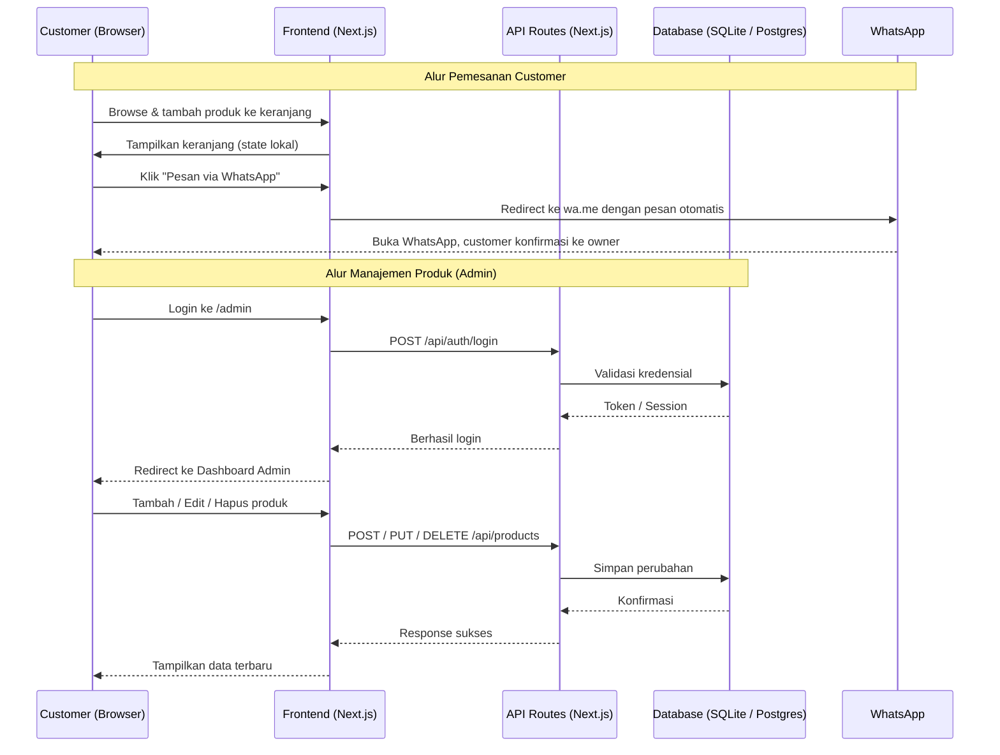
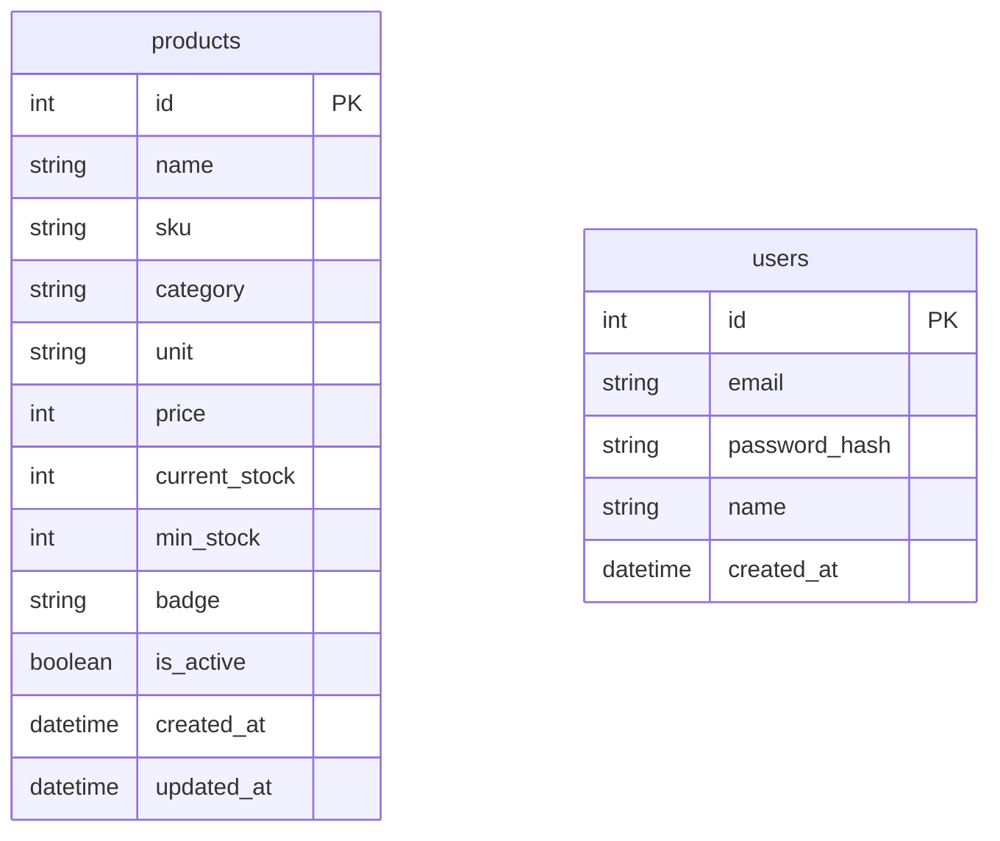

# PRD — Aletta Scarf
### Website E-Commerce Hijab Medis untuk Coass Muslimah

---

## 1. Overview

**Aletta Scarf** adalah brand hijab medis yang didirikan oleh seorang mahasiswa kedokteran (coass) perempuan berusia 22 tahun di Yogyakarta. Produk unggulannya adalah hijab dengan lubang di area telinga, dirancang khusus agar pemakai dapat menggunakan stetoskop tanpa perlu melepas kerudung — sebuah solusi nyata bagi tenaga kesehatan muslimah. Selain hijab medis, brand ini juga menjual ciput, mukena premium, dan ikat rambut.

Masalah yang ingin diselesaikan adalah ketiadaan platform digital yang merepresentasikan brand ini secara profesional. Saat ini penjualan masih bergantung pada media sosial dan komunikasi langsung, sehingga pengalaman belanja customer tidak terstruktur dan owner kesulitan mengelola stok produk.

Tujuan utama proyek ini adalah membangun **website e-commerce sederhana** dengan dua sisi:

- **Sisi Customer (Storefront):** Platform yang memungkinkan pengunjung menelusuri produk, memilih item, memasukkan ke keranjang, dan melakukan pemesanan via WhatsApp.
- **Sisi Admin:** Panel manajemen bagi owner untuk mengelola data produk dan stok gudang.

---

## 2. Requirements

Berikut adalah persyaratan tingkat tinggi untuk pengembangan sistem:

- **Aksesibilitas:** Aplikasi harus dapat diakses melalui web browser, baik desktop maupun mobile.
- **Pengguna:** Terdapat dua tipe pengguna — **Customer** (pengunjung publik, tanpa login) dan **Admin** (owner, dengan login).
- **Checkout:** Alur pemesanan tidak menggunakan payment gateway. Setelah customer mengisi keranjang, sistem akan me-redirect ke WhatsApp dengan pesan otomatis berisi detail pesanan.
- **Manajemen Produk:** Admin dapat melakukan CRUD (Create, Read, Update, Delete) produk beserta pengelolaan stok secara manual.
- **Bahasa:** Seluruh konten antarmuka menggunakan Bahasa Indonesia.
- **Identitas Visual:** Tampilan mengikuti identitas brand — feminine, elegan, dengan palet warna pink pastel dan tipografi serif.

---

## 3. Core Features

### 3.1 Sisi Customer (Storefront)

1. **Halaman Beranda (Home)**
   - Hero section dengan tagline brand dan call-to-action menuju koleksi produk.
   - Strip informasi promo (misal: gratis ongkir, highlight produk).
   - Seksi keunggulan brand (inovasi lubang telinga, bahan premium, dll).

2. **Katalog Produk**
   - Tampilkan semua produk dengan filter berdasarkan kategori: Hijab Medis, Ciput, Mukena Premium, Ikat Rambut.
   - Opsi sortir: Terbaru, Terlaris, Harga Naik, Harga Turun.
   - Setiap kartu produk menampilkan: foto (placeholder), nama, SKU, harga, stok, dan badge (Best Seller / New / Limited / Premium).

3. **Keranjang Belanja**
   - Customer dapat menambah/mengurangi jumlah item atau menghapus item dari keranjang.
   - Keranjang menampilkan ringkasan total harga.
   - Tidak diperlukan login untuk menggunakan keranjang.

4. **Checkout via WhatsApp**
   - Tombol "Pesan via WhatsApp" membuka WhatsApp dengan pesan otomatis berisi daftar produk, jumlah, dan total harga.
   - Nomor WhatsApp tujuan dikonfigurasi di sisi admin atau environment variable.

### 3.2 Sisi Admin

5. **Login Admin**
   - Halaman login dengan email dan password.
   - Akses terbatas hanya untuk satu akun admin (owner).

6. **Dashboard Admin**
   - Ringkasan total produk, total stok, dan jumlah produk per kategori.
   - Peringatan visual untuk produk dengan stok di bawah minimum (Low Stock Alert).

7. **Manajemen Produk (CRUD)**
   - Tambah produk baru dengan form input.
   - Edit data produk yang sudah ada.
   - Hapus produk (dengan konfirmasi).
   - Field wajib: Nama Produk, SKU, Kategori, Harga, Stok Saat Ini, Stok Minimum, Satuan, Badge (opsional), Status Aktif/Nonaktif.

8. **Update Stok**
   - Admin dapat menambah atau mengurangi stok produk langsung dari halaman manajemen produk.
   - Input berupa angka perubahan stok (tambah/kurang) tanpa sistem batch atau riwayat pergerakan stok.

---

## 4. User Flow

### 4.1 Alur Customer

```
Buka Website
    └─> Lihat Beranda
         └─> Browse Katalog Produk
              ├─> Filter / Sortir Produk
              └─> Klik Produk
                   └─> Tambah ke Keranjang
                        └─> Lihat Keranjang
                             ├─> Edit Jumlah / Hapus Item
                             └─> Klik "Pesan via WhatsApp"
                                  └─> Redirect ke WhatsApp dengan pesan otomatis
```

### 4.2 Alur Admin

```
Buka /admin
    └─> Login (email + password)
         └─> Dashboard Admin
              ├─> Lihat ringkasan stok & peringatan low stock
              └─> Menu Produk
                   ├─> Tambah Produk Baru
                   ├─> Edit Produk
                   ├─> Update Stok (tambah / kurangi)
                   └─> Hapus Produk
```

---

## 5. Architecture

Berikut adalah gambaran arsitektur sistem dan aliran data:



---

## 6. Database Schema

Berikut adalah ERD yang menggambarkan struktur database:



| Tabel | Deskripsi |
|-------|-----------|
| **products** | Master data semua produk — nama, SKU, kategori, harga, stok saat ini, stok minimum, badge, dan status aktif |
| **users** | Data akun admin yang memiliki akses ke panel manajemen |

> Catatan: Sistem ini tidak menggunakan tabel `orders` karena proses pemesanan diselesaikan di luar sistem (via WhatsApp). Jika di masa depan ingin dicatat, tabel `orders` dapat ditambahkan.

---

## 7. Pages & Routes

| Route | Tipe | Deskripsi |
|-------|------|-----------|
| `/` | Public | Halaman beranda (hero, keunggulan brand) |
| `/produk` | Public | Katalog produk dengan filter & sortir |
| `/keranjang` | Public | Halaman keranjang belanja |
| `/admin` | Redirect | Redirect ke `/admin/login` jika belum login |
| `/admin/login` | Auth | Halaman login admin |
| `/admin/dashboard` | Protected | Dashboard ringkasan stok & low stock alert |
| `/admin/produk` | Protected | Daftar semua produk + tombol CRUD |
| `/admin/produk/tambah` | Protected | Form tambah produk baru |
| `/admin/produk/[id]/edit` | Protected | Form edit produk |

---

## 8. Design & Technical Constraints

### 8.1 Identitas Visual

Desain mengikuti identitas brand Aletta Scarf: **feminine, bersih, dan elegan**. Referensi utama adalah logo brand yang menggunakan palet pink pastel dengan tipografi serif.

| Elemen | Nilai |
|--------|-------|
| Warna utama | Pink pastel `#FDF0F3` → `#72243E` |
| Aksen | `#993556` (pink-600) untuk CTA dan highlight |
| Background | Putih bersih dan pink-50 untuk seksi alternatif |
| Tipografi heading | `Cormorant Garamond, serif` — elegan, feminine |
| Tipografi body / UI | `Jost, Geist Mono, ui-monospace, monospace` |
| Tipografi kode | `JetBrains Mono, monospace` |
| Border radius | `4px` untuk elemen UI, `8px` untuk kartu produk |
| Border | `0.5px solid` dengan warna pink-100 / pink-200 |

### 8.2 Typography Rules

Sesuai PRD referensi, konfigurasi font variable yang wajib digunakan:

- **Sans:** `Geist Mono, ui-monospace, monospace`
- **Serif:** `Cormorant Garamond, serif`
- **Mono:** `JetBrains Mono, monospace`

### 8.3 High-Level Technology

Sistem dibangun menggunakan teknologi modern yang mendukung pengembangan cepat dan kemudahan pemeliharaan. Pengembang dibebaskan memilih tools yang tepat dengan rekomendasi:

- **Frontend & Backend:** Next.js (App Router) — fullstack dalam satu codebase
- **Database:** SQLite (development) / PostgreSQL (production)
- **ORM:** Prisma
- **Auth:** NextAuth.js atau custom JWT session
- **Styling:** Tailwind CSS
- **Deployment:** Vercel

### 8.4 Non-Functional Requirements

- Halaman storefront harus **mobile-responsive** karena mayoritas customer mengakses via smartphone.
- Gambar produk menggunakan placeholder saat tidak ada foto yang diupload.
- Keranjang belanja disimpan di **local state / localStorage** (tidak perlu backend).
- Pesan WhatsApp dibuat secara dinamis di sisi client menggunakan template string.

---

## 9. Out of Scope (MVP)

Fitur berikut **tidak termasuk** dalam versi pertama dan dapat dipertimbangkan di iterasi berikutnya:

- Payment gateway (Midtrans, Xendit, dll)
- Sistem login / akun untuk customer
- Riwayat transaksi / order management
- Notifikasi email atau push notification
- Upload foto produk (fase 1 menggunakan placeholder)
- Sistem ulasan / rating produk
- Fitur batch dan movement log stok (sesuai PRD referensi gudang)
- Multi-admin / role management
